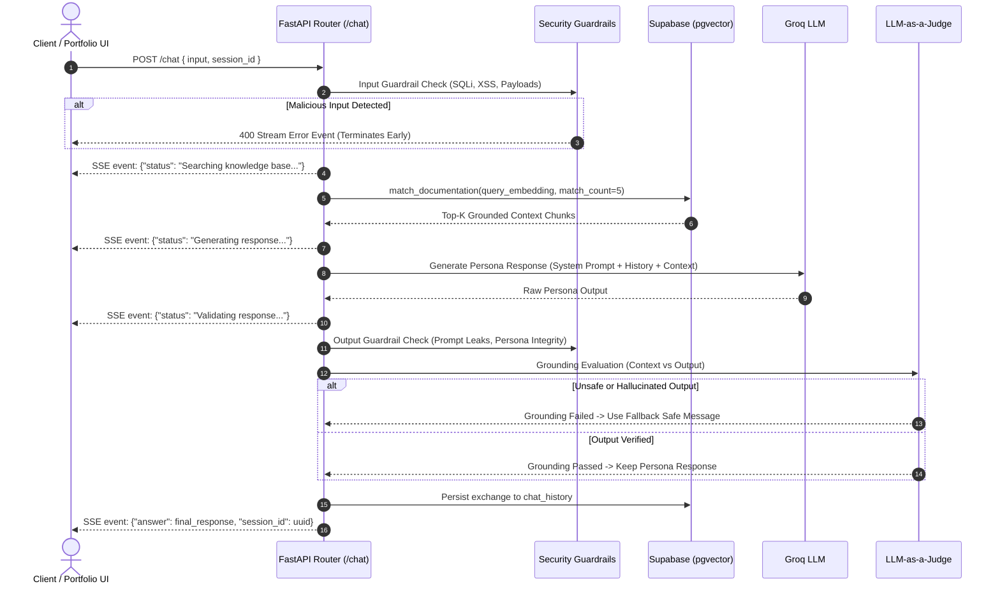
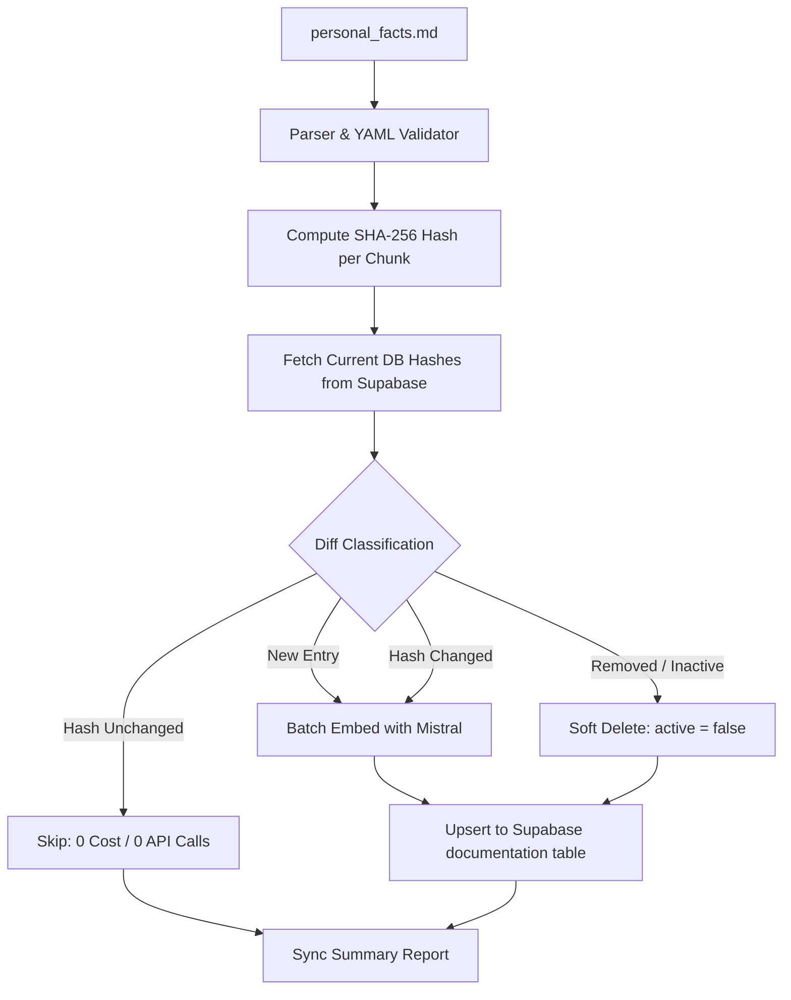

# AI Persona Chatbot

> **Production-Grade RAG Engine with Multi-Tier Security Guardrails, LLM-as-a-Judge Grounding, and Automated Hash-Diff Vector Ingestion**

[](https://fastapi.tiangolo.com)
[](https://www.python.org/)
[](https://www.langchain.com/)
[](https://supabase.com)
[](https://groq.com)
[](https://mistral.ai)
[](https://opensource.org/licenses/MIT)

---

## Overview

**AI Persona Chatbot** is a real-time, retrieval-augmented conversational AI system designed to act as an interactive digital persona of **Yash Pinjarkar**. It answers technical, professional, and architectural questions in first person using grounded knowledge from a structured markdown knowledge base.

Beyond standard RAG implementations, this system features **two independent security guardrails**, an **evaluator LLM-as-a-Judge** to eliminate hallucinations, **Server-Sent Events (SSE)** for non-blocking status streaming, and an **idempotent SHA-256 hash-diff ingestion engine** that minimizes embedding API costs.

```
┌──────────────┐     SSE Stream      ┌─────────────────┐    Vector Search    ┌──────────────────────┐
│ Web Client / │ ◄─────────────────► │ FastAPI Backend │ ◄─────────────────► │ Supabase (pgvector)  │
│ Portfolio UI │  (Status + Answer)  │  (RAG Pipeline) │                     │ (Documentation & DB) │
└──────────────┘                     └────────┬────────┘                     └──────────────────────┘
                                              │
                                    LLM / Embeddings APIs
                                              │
                                     ┌────────▼────────┐
                                     │ Groq (Llama-3.3)│
                                     │ Mistral Embed   │
                                     └─────────────────┘
```

---

## Key Features

- 🎭 **First-Person AI Persona**: Accurately articulates technical projects, engineering philosophies, background, and skills in a concise, professional tone.
- 🛡️ **Two-Tier Security Guardrails**:
  - **Input Guardrail**: Inspects queries for SQL injections (`UNION SELECT`, `DROP TABLE`), cross-site scripting (XSS), null bytes, and oversized payloads.
  - **Output Guardrail**: Sanitizes model generations to prevent system prompt extraction, persona breakdown, and jailbreak attempts.
- ⚖️ **LLM-as-a-Judge Grounding**: Runs a secondary evaluator LLM pass comparing retrieved context against the generated output. If the response is ungrounded or hallucinatory, it falls back to a safe, honest refusal.
- ⚡ **Server-Sent Events (SSE) Streaming**: Streams real-time pipeline status indicators (`Searching knowledge base...` → `Generating response...` → `Validating response...`) followed by the verified payload.
- 🔄 **Hash-Diff Ingestion Engine**: Uses SHA-256 chunk hashing to classify entries as `NEW`, `UPDATED`, `UNCHANGED`, or `ARCHIVED`. Only re-embeds new or modified content (**0 unnecessary Mistral API calls**).
- 🔐 **Constant-Time Admin Authentication**: Admin routes (`/admin/sync`, `/admin/entry`) are protected via `secrets.compare_digest` to prevent side-channel timing attacks.
- 🗄️ **Persistent Chat History**: Session-isolated conversation history stored in Supabase with UUID validation and indexed lookup.

---

## Architecture & Workflow

### 1. Request Lifecycle & RAG Pipeline



---

### 2. Knowledge Ingestion & Vector Synchronization



---

## Tech Stack

| Layer | Technology | Purpose |
|---|---|---|
| **API Framework** | [FastAPI](https://fastapi.tiangolo.com/) | Asynchronous, high-performance web framework |
| **ASGI Server** | [Uvicorn](https://www.uvicorn.org/) | Production-ready ASGI server |
| **Orchestration** | [LangChain](https://www.langchain.com/) | RAG pipeline, prompt templates, and message formatting |
| **LLM Inference** | [Groq](https://groq.com/) | Ultra-low latency inference (`Llama 3.3 70B` / `GPT-OSS`) |
| **Embeddings** | [Mistral AI](https://mistral.ai/) | 1024-dimensional embeddings (`mistral-embed`) |
| **Database & Vectors**| [Supabase](https://supabase.com/) (`pgvector`) | Postgres database with vector similarity index (`IVFFlat`) |
| **Data Validation** | [Pydantic v2](https://docs.pydantic.dev/) | Strict request/response validation and schemas |
| **Configuration** | [python-dotenv](https://pypi.org/project/python-dotenv/) | Environment variable management |
| **Package Manager**| [`uv`](https://docs.astral.sh/uv/) / `pip` | Fast Python dependency resolver and virtual environment |

---

## Project Structure

```
Chat-Web/
├── app/
│   ├── routes/
│   │   ├── admin.py             # Authenticated /admin/sync and /admin/entry endpoints
│   │   ├── chat.py              # SSE Streaming /chat and /start endpoints
│   │   └── health.py            # /health liveness probe
│   ├── schema/
│   │   ├── admin.py             # Pydantic schemas for knowledge entries and sync responses
│   │   └── chat.py              # Pydantic schemas for chat requests and sessions
│   ├── services/
│   │   ├── ingestion.py         # Markdown parser, SHA-256 hasher, diffing & vector sync
│   │   ├── rag.py               # Input/output guardrails, retrieval, LLM & judge
│   │   └── supabase_client.py   # Cached Supabase client singleton
│   ├── config.py                # Type-safe application settings & env loader
│   └── main.py                  # FastAPI application entrypoint & CORS middleware
├── ingest.py                    # Standalone CLI ingestion script (--dry-run, --verbose)
├── personal_facts.md            # Primary source of truth knowledge base
├── requirements.txt             # Python project dependencies
├── pyproject.toml               # Modern Python project configuration
├── .example.env                 # Example environment variables template
└── README.md                    # Project documentation
```

---

## Getting Started

### Prerequisites

- Python 3.11 or higher
- A [Supabase](https://supabase.com/) project (with `pgvector` enabled)
- A [Groq Cloud](https://console.groq.com/) API Key
- A [Mistral AI](https://console.mistral.ai/) API Key

---

### 1. Clone & Set Up Environment

```bash
# Clone the repository
git clone https://github.com/yashpinjarkar10/Chat-Web.git
cd Chat-Web

# Create and activate virtual environment using uv (recommended)
uv venv
.venv\Scripts\activate   # Windows
# source .venv/bin/activate  # macOS / Linux

# Install dependencies
uv add -r requirements.txt
# or standard pip: pip install -r requirements.txt
```

---

### 2. Configure Environment Variables

Copy the example `.env` file:
```bash
cp .example.env .env
```

Populate the `.env` file with your credentials:

| Variable | Description | Example |
|---|---|---|
| `GROQ_API_KEY` | Groq API Key for LLM Inference | `gsk_...` |
| `MistralAI` | Mistral AI API Key for Embeddings | `your-mistral-api-key` |
| `SUPABASE_URL` | Supabase Project URL | `https://your-ref.supabase.co` |
| `SUPABASE_KEY` | Supabase Anon Public Key | `eyJhb...` |
| `SUPABASE_SERVICE_KEY` | Supabase Service Role Key (Server-side writes) | `eyJhb...` |
| `ADMIN_API_KEY` | Secret Key for `/admin/*` route authentication | `secret_admin_token_123` |
| `CORS_ALLOW_ORIGINS` | Comma-separated list of allowed CORS origins | `http://localhost:3000,*` |
| `FACTS_FILE_PATH` | (Optional) Path to knowledge markdown file | `./personal_facts.md` |

---

### 3. Initialize the Vector Database

Populate your database by running the CLI ingestion tool:

```bash
# 1. Preview changes safely (Dry-run mode)
python ingest.py --dry-run

# 2. Run full initial ingestion
python ingest.py --verbose
```

---

### 4. Start the Application Server

```bash
python app/main.py
# or using uvicorn directly:
uvicorn app.main:app --host 0.0.0.0 --port 8080 --reload
```

The API will be available at `http://localhost:8080`.

---

## API Reference

### 1. Chat Stream (`POST /chat`)

Handles streaming chat queries through guardrails, vector retrieval, LLM response generation, and grounding judgment.

- **URL:** `/chat`
- **Method:** `POST`
- **Content-Type:** `application/json`
- **Response Format:** `text/event-stream` (Server-Sent Events)

#### Request Body:
```json
{
  "input": "What projects has Yash built with LangGraph?",
  "session_id": "optional-uuid-string"
}
```

#### SSE Stream Output:
```http
data: {"status": "Searching knowledge base..."}

data: {"status": "Generating response..."}

data: {"status": "Validating response..."}

data: {"answer": "I built a 13-agent financial analysis and trading system orchestrated with LangGraph, featuring deterministic routing and FastAPI SSE streaming.", "session_id": "8f31b26c-d68a-4421-9954-df0a8803ab4e"}
```

---

### 2. Admin Vector Sync (`POST /admin/sync`)

Triggers a manual hash-diff synchronization between `personal_facts.md` and the Supabase vector store.

- **URL:** `/admin/sync`
- **Method:** `POST`
- **Headers:** `X-Admin-Key: <ADMIN_API_KEY>`

#### Example Request:
```bash
curl -X POST http://localhost:8080/admin/sync \
  -H "X-Admin-Key: your-secret-admin-key"
```

#### Response:
```json
{
  "message": "Knowledge base synchronized successfully.",
  "result": {
    "inserted": 0,
    "updated": 1,
    "archived": 0,
    "unchanged": 50
  }
}
```

---

### 3. Admin Add / Update Fact (`POST /admin/entry`)

Adds or modifies a specific fact entry directly in `personal_facts.md` and automatically re-indexes it into the vector database.

- **URL:** `/admin/entry`
- **Method:** `POST`
- **Headers:** 
  - `Content-Type: application/json`
  - `X-Admin-Key: <ADMIN_API_KEY>`

#### Request Body:
```json
{
  "entity_name": "Trading Agent",
  "title": "architecture",
  "category": "project",
  "subcategory": "architecture",
  "tags": ["langgraph", "fastapi", "multi-agent"],
  "date_range": "2025-2026",
  "status": "ongoing",
  "priority": 1,
  "links": {
    "github": "https://github.com/yashpinjarkar10/Trading-Agent"
  },
  "metrics": ["unified analysis report produced in ~6 seconds"],
  "content": "The Trading Agent orchestrates a 13-agent collective using LangGraph and FastAPI...",
  "active": true,
  "source": "manual_entry"
}
```

---

### 4. Health Check (`GET /health`)

- **URL:** `/health`
- **Method:** `GET`
- **Response:**
  ```json
  {
    "status": "healthy",
    "service": "chat-web-api"
  }
  ```

---

## Security & Reliability Design

1. **Side-Channel Timing Attack Prevention**:
   Admin key verification uses `secrets.compare_digest(admin_key, settings.admin_api_key)` instead of standard string equality, guaranteeing constant-time comparison.
2. **Deterministic Input Sanitization**:
   High-speed regular expressions intercept SQL injection patterns (`\b(union select|insert into|drop table)\b`) and XSS script tags before invoking external LLMs.
3. **Automated Soft Deletion**:
   Entries deleted from the source markdown file are marked `active = false` rather than destroyed, preserving foreign key integrity with historical chat sessions.
4. **Session-Level Context Isolation**:
   Chat histories are scoped by strict UUID keys, ensuring multi-turn context cannot leak between distinct client sessions.

---

## Deployment Guide (Docker / Cloud)

### Dockerfile
```dockerfile
FROM python:3.11-slim

WORKDIR /app

ENV PYTHONUNBUFFERED=1 \
    PYTHONDONTWRITEBYTECODE=1

RUN apt-get update && apt-get install -y --no-install-recommends curl && rm -rf /var/lib/apt/lists/*

COPY requirements.txt .
RUN pip install --no-cache-dir -r requirements.txt

COPY . .

EXPOSE 8080

CMD ["uvicorn", "app.main:app", "--host", "0.0.0.0", "--port", "8080"]
```

### Running with Docker:
```bash
# Build Docker image
docker build -t ai-persona-chatbot .

# Run container with environment file
docker run -d -p 8080:8080 --env-file .env --name persona-chatbot ai-persona-chatbot
```

---

## Author & Contact

**Yash Pinjarkar**  
- **Email**: [yashpinjarkar2003@gmail.com](mailto:yashpinjarkar2003@gmail.com)  

---

## License

This project is licensed under the [MIT License](LICENSE).
